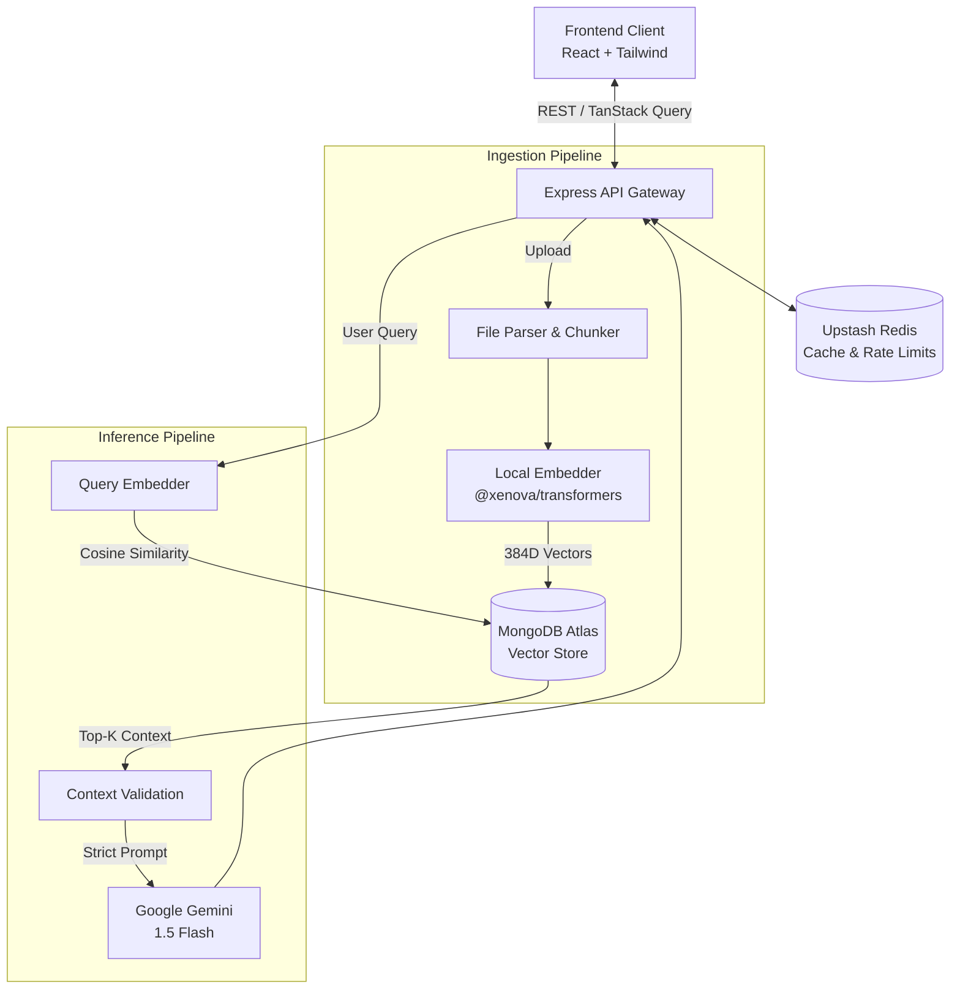

<div align="center">
  <h1>Smart Knowledge Vault</h1>
  <p><strong>Enterprise-Grade RAG Document Intelligence Platform</strong></p>
  
  <p>
    
    
    
    
    
  </p>
</div>

---

## 📖 Overview

**Smart Knowledge Vault** is a high-performance Retrieval-Augmented Generation (RAG) system designed to securely ingest, embed, and query unstructured documentation. Unlike naive LLM implementations, this architecture utilizes **local semantic embedding pipelines** coupled with cloud-native **Vector Databases** to deliver rapid semantic search capabilities with robust token economics.

## 🏗️ System Architecture



## ⚡ Core Engineering Features

1. **Edge/Local Vectorization (Transformers.js):**
   - Implements `all-MiniLM-L6-v2` directly in the Node.js runtime.
   - Eliminates third-party embedding API costs and reduces latency for vectorization.
2. **Hybrid Cloud Vector Store:**
   - Native integration with MongoDB Atlas `$vectorSearch` utilizing HNSW indexing for rapid Cosine Similarity approximations in large vector spaces.
3. **Advanced RAG Prompt Engineering:**
   - Rejects hallucination logic via strictly bounded context windows and fallback grounding constraints prior to Gemini 1.5 Flash inference.
4. **Resilient API Backbone:**
   - Upstash Redis-backed API caching layer delivering <20ms edge responses for duplicate queries.
   - Token-bucket rate limiting via `express-rate-limit` protecting against distributed enumeration.

## 🛠️ Quickstart Guide

### Prerequisites
- Node.js (v18.x+)
- MongoDB Atlas Cluster (Free tier Supported)
- Upstash Serverless Redis Endpoint
- Google AI Studio API Key (Gemini)

### 1. Vector Search Index
Execute the following JSON specification inside MongoDB Atlas on your `chunks` collection to enable ANN search:
```json
{
  "mappings": {
    "dynamic": true,
    "fields": {
      "embedding": {
        "dimensions": 384,
        "similarity": "cosine",
        "type": "knnVector"
      }
    }
  }
}
```

### 2. Microservice Deployment
```bash
# Clone the repository
git clone https://github.com/YashRanjan292006/Smart-Knowledge-Vault.git
cd Smart-Knowledge-Vault

# Spin up Backend Engine
cd backend
npm install
npm run dev

# Spin up Frontend Web Application
cd ../frontend
npm install
npm run dev
```

## 🔒 Environment Variable Schema

```env
# /backend/.env
PORT=5000
NODE_ENV=development
MONGO_URI=mongodb+srv://<auth>@<cluster>.mongodb.net/vault
JWT_SECRET=super_secure_sha256_hash
GEMINI_API_KEY=AIzaSy...
REDIS_URL=redis://...
```

## 📡 Testing & Validation
The backend is rigorously testing using unit blocks.
```bash
cd backend && npm run test
```

---
<div align="center">
  <p>Engineered by Yash Ranjan | Top 1% MERN & AI Integrations</p>
</div>
