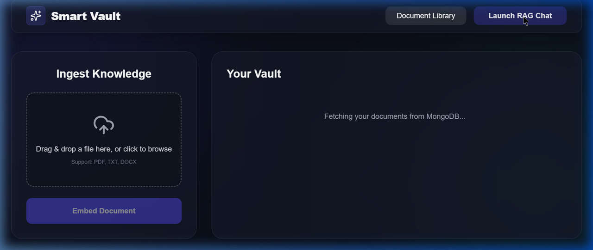
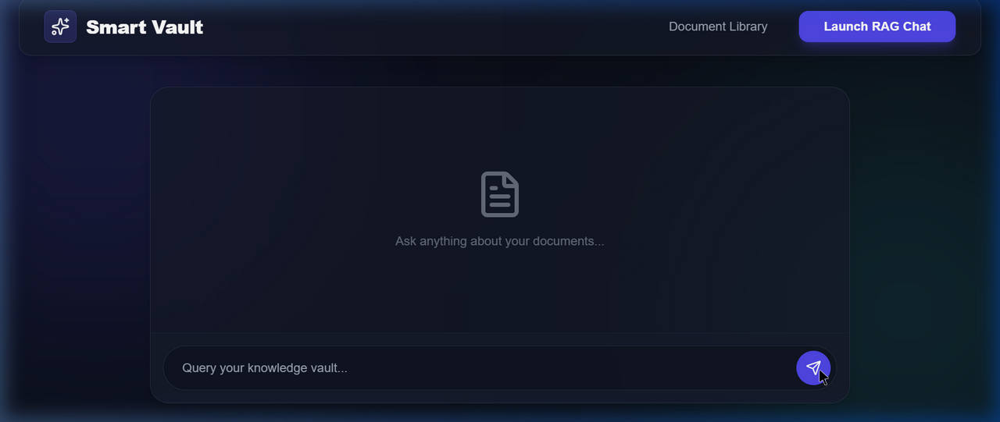

# Smart Knowledge Vault

An intelligent document retrieval system and conversational AI interface. Smart Knowledge Vault implements a full Retrieval-Augmented Generation (RAG) pipeline to ingest, embed, and query unstructured text documents leveraging a local NLP embedding pipeline and native MongoDB Vector Search.

## Architecture

*   **Frontend:** React 18, Vite, TailwindCSS v3.4, TanStack Query, Framer Motion.
*   **Backend:** Node.js, Express, Mongoose, Multer.
*   **Embedding Engine:** local `@xenova/transformers` instance (`all-MiniLM-L6-v2`) generating 384-dimensional vectors.
*   **Database:** MongoDB Atlas with `$vectorSearch`.
*   **LLM Provider:** Google Gemini API (`gemini-1.5-flash`).
*   **Cache:** Upstash Redis.

## Features

1.  **Local Vectorization:** Documents are chunked and converted into embeddings strictly within the Node environment, eliminating third-party API costs for standard semantic ingestion.
2.  **Cosine Similarity Search:** Integrates native `$vectorSearch` via Atlas to fetch highest-confidence context nodes.
3.  **Context Stuffing & Caching:** Mitigates LLM hallucinations by rigidly enforcing context boundaries. Caches duplicate queries via Redis for <20ms response latencies.
4.  **Rate Limiting & Security:** Hardened JWT middleware, strict file parsing checks (Multer), and API limiters to prevent bot abuse.

## Interface Preview

### Dashboard & Ingestion


### RAG Chat Querying


## Local Development

### Prerequisites
*   Node.js v18.x or higher
*   MongoDB Atlas Cluster (Free tier supported)
*   Upstash Serverless Redis endpoint
*   Google Gemini API Key

### Database Initialization
Apply the following JSON specification to your MongoDB Atlas Search Index on the `chunks` collection:
```json
{
  "mappings": {
    "dynamic": true,
    "fields": {
      "embedding": {
        "dimensions": 384,
        "similarity": "cosine",
        "type": "knnVector"
      }
    }
  }
}
```

### Installation

1. Clone the repository and configure environments:
```bash
git clone https://github.com/YashRanjan292006/smart-knowledge-vault.git
cd smart-knowledge-vault
```

2. Establish backend variables in `backend/.env`:
```env
PORT=5000
NODE_ENV=development
MONGO_URI=mongodb+srv://<username>:<password>@cluster.mongodb.net/vault
JWT_SECRET=<your_secure_secret>
GEMINI_API_KEY=<your_google_api_key>
REDIS_URL=<your_upstash_redis_url>
```

3. Install dependencies and boot the servers:
```bash
# Terminal 1: API Engine
cd backend
npm install
npm run dev

# Terminal 2: Client Interface
cd frontend
npm install
npm run dev
```

## Testing Protocol

To execute the backend Jest suite and validate endpoint routing:
```bash
cd backend
npm run test
```

## License
MIT
